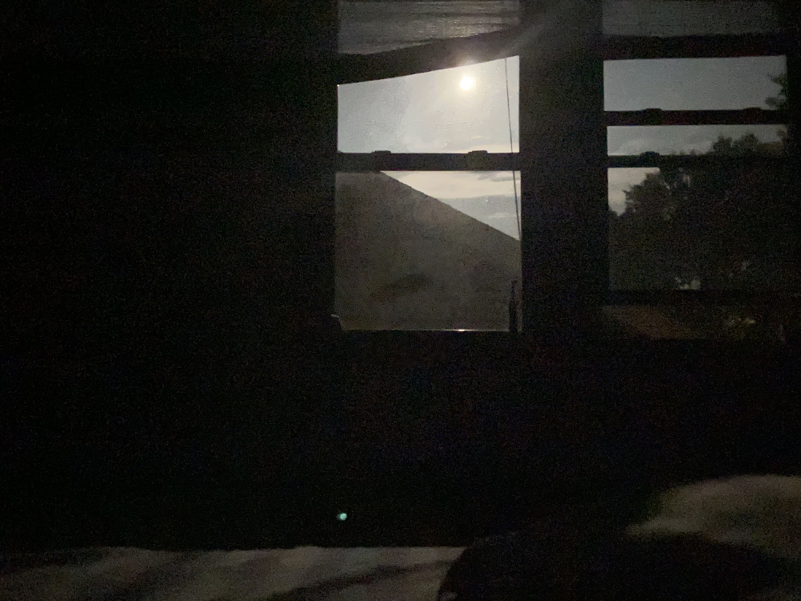

## 床前月

 

伏案才思寝，入枕失槐安。

弹指掠轻影，霜落半窗寒。

凛凛远风起，浩浩流光粲。

皑皑银川雪，邈邈青云汉。

灯明隐璧辉，盏灭归尘黯。

我醒且凭栏，我醉自肠断。

万里隔日夜，天涯散交欢。

世我本相违，独乐须畅酣。

细瓦凝清露，斜檐遮夜乌。

嫦娥应有恨，却洒一人孤。

斗转冥星坠，月没秋枝芜。

芳菲尽凋敝，松柏犹未疏。

少眠劳肝胆，繁务摧心腑。

但随鸿鹄志，大笑泯忧苦。

忽忆旧时梦，惊起赋长歌。

会当擒猛虎，破浪踏山河！

 

08/21/2021

 

