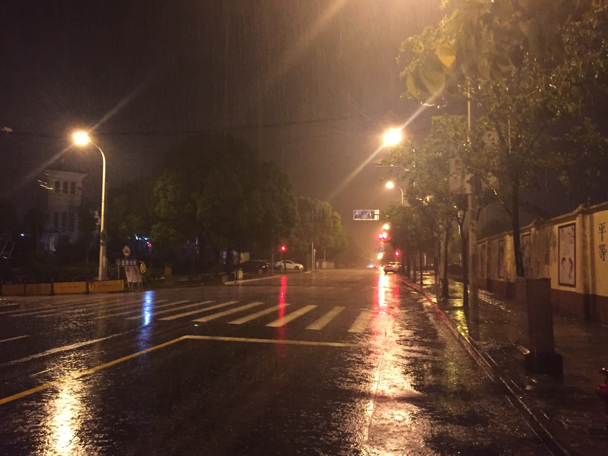

## 雨夜狂行

 

6月23日晚，上海，暴雨。晚十点半从广兰路地铁口徒步行至宾馆，十二点二十左右到达，全程八公里，耗时百余分钟。

 

 

肆意挤出人群、

冲开层层雨伞

俯瞰着呐喊着的摩的司机与焦急的行人

曾经、但已不再少年的青年

选择了从未踏上、

或许会后悔、抑或不会的

独行之路

 

 

**十点半**

 

 

陌生的楼房与立交

以冷漠与阴影

嗤笑着陌生旅人的匆忙

渐行渐稀的摩托引擎

也嗤笑

名为青年者的莽撞轻狂

 

 

**十一点**

 

 

转弯处是谁家的花圃

回头寻觅忘却身处幽巷

有几个的身影在雨中昏黄？

是何处的灯火破碎、飘荡？

 

细雨丝下的步伐、

向下一处黑暗

不带一丝犹豫地、

彷徨

 

啊

希望之光中潜伏着绝望

岔路的前方把魔鬼隐藏

通往远方之路

却是折磨归人的牢房

 

 

**十一点半**

 

 

奔跑

漏雨的伞收在手上

——若论谁为劲敌

雨水怎敌心魔之强？

 

后边来了单车！

快、躲到一旁

前面有个人影！

……

喘息声回荡

 

呼啸着的、

汽车抛起巨浪

喧嚣的雨中这份静谧

将青年的孤独埋葬

 

伫、瞑、

十字路口如孤岛之于海洋

桥、望、

建筑工地的眼中闪烁着忧伤

啊！

孤寂的雨夜

迷失者缥缈灵魂的游乐场！

 

 

**十二点**

 

 

暴风、疯狂、

倾盆而下的疯狂

狂放、放浪

毁天灭地的放浪

浪荡、荡漾

不羁灵魂的荡漾

 

琵琶弦急岂与辨

铁骑枪鸣差可量

秋池水漫人无影

明朝杏败荷满塘

 

哈哈

病惧之盛宴

午夜之交响

力量、阻挡、碰撞！

 

さあ、来い！嵐よ、

この理不尽な世界をぶち壊せろう！

 

……

 

不知何时何地

唯余雨声沧沧、

远景茫茫

归途的终点处

青年茫然失神

霁、

叹、

醒。

 

书于上海市 宾馆内

2017/6/24 凌晨2:05

 

 

后记：

本来只是错过了末班地铁，如果按照我一如既往的冷静的判断，一定会直接坐公交、面的或者摩的甚至找派出所警察帮助，毕竟走回去既不安全、天气又极差。但我最终没有这么选择，这和当时的情形以及我当天的其他经历有一些关联。另一方面我又想，选错了就将错就错吧，走到底。事后再看，如果单纯地把这次的选择看成一次体验的话，似乎也不错，平安抵达，还留下了一篇有感而发的诗作。让我抉择的话，这次我不想责怪自己。这样疯狂的冒险应该不会有下次了吧。

 

 

趣事：

走在路上，看见几个摆摊卖凉面的汉子坐在自己的破摊子下，勉强避着雨。我心生同情，心想这样的夜里竟有似我这般有家难归的凄惨之人。本想再构思几句诗，走近一看，此人竟然在玩王者荣耀……我顿时……真可谓百感交集、百般无语，不知是哭是笑，一时间竟诗兴全无。后来想起，觉得实在有趣，便记录于此。

